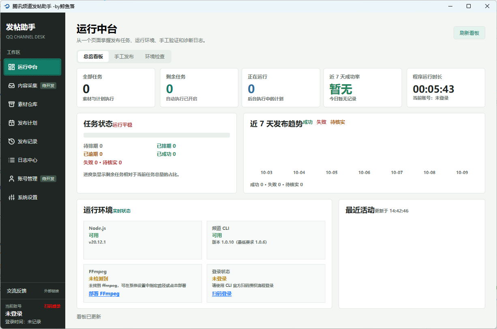

# QQ 频道发布台

一个面向 Windows 的 QQ 频道内容管理与发布工具。

项目通过 WPF 桌面界面整合环境检查、扫码授权、内容采集、素材管理、发布计划和发布记录，并调用官方 CLI 完成 QQ 频道 Feed 发布。数据默认保存在本机 SQLite 数据库，不依赖远程业务服务器。

> **重要提示**：发布操作会真实创建频道内容。请仅使用本人账号和本人有权限管理的频道，发布前确认账号、目标版块和内容无误。

## 项目地址

- Gitee：<https://gitee.com/vopipi/auto_push_qqpd>
- GitHub：<https://github.com/VoPiPi/auto_push_qqpd>

## 功能介绍

### 环境检查

- 检测 Node.js、`tencent-channel-cli`、FFmpeg 和当前登录状态。
- Node.js 或 CLI 缺失时，经用户确认后支持安装或重试。
- FFmpeg 使用项目本地 `tools` 目录中的压缩包手动部署，不联网下载，不修改系统 PATH。
- 检查结果相互独立，某一项失败不会中断其他环境检查。

### 扫码授权与频道同步

- 使用 CLI 官方扫码流程完成登录授权。
- 登录成功后同步当前账号可访问的频道和版块。
- 二维码、授权链接和 Token 不写入日志或项目配置。

### 内容与发布

- 支持文本、图片和视频 Feed 发布。
- 发布前展示目标、内容和媒体信息，并进行二次确认。
- 支持本地媒体文件，也支持符合要求的公开媒体链接。
- 发布完成后保存状态、结果、发布时间及可用帖子链接。

### 内容采集与素材仓库

- 从公开 HTTP/HTTPS 网页提取标题和正文，保存为收件箱内容或发布草稿。
- 支持草稿编辑、关键词搜索、标签和状态管理。
- 管理文本、图片和视频素材，可指定频道、版块和发布时间。

### 发布计划与记录

- 创建、查看、取消和检查定时发布任务。
- 支持自动执行计划、设置最大并发数，以及配置启动时是否补发逾期任务。
- 发布记录支持按日期、类型和标题/内容进行筛选，并可查看结果和帖子链接。
- 超时或程序异常退出时不会自动重复发布，结果可能标记为"待核实"，需要先检查频道实际状态。

### 系统设置

- Windows 开机启动。
- 最小化到系统托盘或关闭程序。
- 计划任务执行策略和诊断日志详细程度。
- 可选检查 Gitee 最新版本；发现新版本时只提示并打开 Release 页面，不自动下载或覆盖程序。

> "账号管理"页面目前保留为功能入口，多账号管理能力尚未实现；扫码登录由环境检查页面和 CLI 授权流程提供。

## 技术栈

| 类别 | 技术 |
| --- | --- |
| 桌面框架 | C#、WPF、.NET 8 |
| UI 控件 | HandyControl |
| 本地数据库 | SQLite、Microsoft.Data.Sqlite |
| 发布执行 | Node.js、`tencent-channel-cli` |
| 网页解析 | HtmlAgilityPack |
| 压缩包处理 | SharpCompress |

## 环境要求

- Windows 10 或更高版本
- .NET 8 SDK（源码运行和编译）
- .NET 8 Desktop Runtime（运行已构建程序）
- Node.js
- `tencent-channel-cli`

首次使用时，可在"环境检查"页面按照提示安装 Node.js 或 CLI；也可以先手动准备好运行环境。

## 快速开始

### 1. 获取源码

```bash
git clone https://gitee.com/vopipi/auto_push_qqpd.git
cd auto_push_qqpd
```

### 2. 启动开发版本

在仓库根目录打开 PowerShell：

```powershell
dotnet run --project .\src\QqChannelDesk\QqChannelDesk.csproj
```

### 3. 构建 Release

```powershell
dotnet build .\src\QqChannelDesk\QqChannelDesk.csproj -c Release
```

### 4. 运行测试

```powershell
dotnet test .\tests\QqChannelDesk.Tests\QqChannelDesk.Tests.csproj -c Release
```

### 5. 制作更新包

更新包由发布者在干净的 `dotnet publish` 输出上制作，不从正在运行的用户目录打包：

```powershell
.\scripts\Build-UpdateZip.ps1 -Version 1.0.1
```

脚本生成的 ZIP 只包含应用运行文件，明确排除 `channels.db`、`account.session.json`、`channels.sync.json`、`settings.json`、日志、`temp`、媒体缓存和 `tools`。上传到 [Gitee Releases](https://gitee.com/vopipi/auto_push_qqpd/releases) 后，用户关闭程序并将 ZIP 内容覆盖到原程序目录即可。覆盖前请保留用户目录中的数据库、登录授权文件、日志、素材和本地工具。

发布标签建议使用 `v主版本.次版本.修订版本`，例如 `v1.0.1` 或 `v1.0.1-release`。程序只比较其中的数字版本，不执行 Release 资产中的任何脚本。

## FFmpeg 本地工具包

仓库内的 FFmpeg 压缩包位于：

```text
src/QqChannelDesk/tools/ffmpeg-9.0.2-essentials_build.7z
```

点击"手动部署"后，程序从应用对应的本地 `tools` 目录查找名称符合以下格式的压缩包：

```text
ffmpeg-版本号-描述.7z
ffmpeg-版本号-描述.zip
```

部署后文件位于：

```text
tools/ffmpeg/bin
```

开发运行时使用源码项目中的 `src/QqChannelDesk/tools`；Release 构建会将工具包复制到程序目录旁的 `tools` 目录。程序不会从 `artifacts` 目录寻找主工具包，也不会联网下载 FFmpeg。

仓库中的 FFmpeg Essentials 便携构建来自 Gyan.dev，涉及 GPL 许可证。重新分发应用或 FFmpeg 压缩包前，请阅读并遵守相应许可证要求。

## 数据与隐私

默认数据文件位于程序目录：

| 文件或目录 | 用途 |
| --- | --- |
| `channels.db` | 频道缓存、内容、素材、发布计划和发布记录 |
| `channels.sync.json` | 频道同步状态，不保存 Token 或 Cookie |
| `account.session.json` | 本地账号昵称和登录时间展示信息，不存储 CLI 授权凭证 |
| `logs/` | 按日期保存的程序日志 |
| `tools/media-cache/` | 公开媒体链接的本地缓存 |
| `%LOCALAPPDATA%/QqChannelDesk/settings.json` | 部分本地界面设置 |

安全边界：

- 不采集或保存 Token、Cookie 等账号凭证。
- 扫码响应中的二维码和授权链接不会写入日志。
- 公开网页采集不读取 Cookie、不访问登录页面、不绕过验证码或反爬。
- 保存、转载和发布网页内容或媒体前，请确认拥有相应授权。
- 程序所在目录需要具备写入权限，以便保存数据库、日志和媒体缓存。

发布记录不保存正文、授权凭证或媒体完整路径；仅保存执行所需的摘要信息和可用结果链接。

## 项目结构

```text
src/QqChannelDesk/
├── Pages/                 主窗口中的独立功能页面
├── Services/              CLI、数据库、采集、媒体和计划服务
├── MainWindow.xaml        主窗口与导航
├── LoginWindow.xaml       扫码登录窗口
├── PublishDialog.xaml     发布确认窗口
└── tools/                 随项目提供的本地工具包

tests/                     自动化测试
docs/                      人工验证清单和调研文档
LICENSE                    项目许可证
```

## 当前限制

- 当前支持单条文本、图片或视频 Feed 发布。
- 多账号管理、批量发布、模板和复杂失败重试尚未实现。
- 计划任务执行依赖程序运行；是否在启动时处理逾期任务由设置项控制。
- 平台限制和 CLI 参数可能变化，实际行为以当前 CLI 和 QQ 频道平台规则为准。
- 更新功能只负责读取公开 Gitee Release 元数据和提醒用户；当前版本不自动下载、安装、替换或回滚程序文件。

真实发布前，建议先在本人管理的测试频道验证文本、图片、视频和计划执行流程。人工验证清单见 [`docs/manual-validation-checklist.md`](docs/manual-validation-checklist.md)。

## 许可证

本项目许可证见仓库根目录 [`LICENSE`](LICENSE)。项目中随附的 FFmpeg 压缩包还需遵守其对应的 GPL 许可证要求。